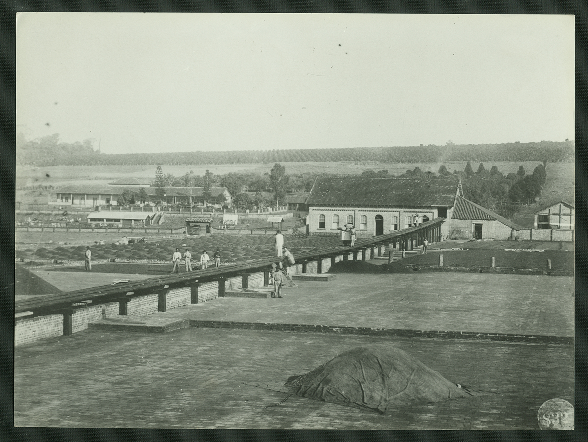

<table class="wide">
<tr>
  <td class="left">
    
  </td>
  <td class="right">
    
  </td>
</tr>
<tr>
  <td class="left">
    
  </td>
  <td class="right">
    
  </td>
</tr>
</table>

  

      <ul class="nav">
          <li><a href="https://github.com/mangonnet">GitHub</a></li>
          <li><a href="https://twitter.com/jmangonnet">Twitter</a></li>
      </ul>
  

